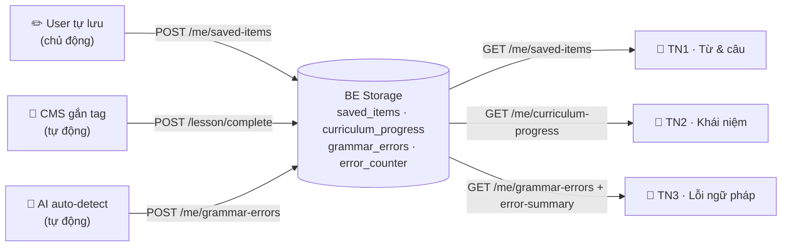

# Practice Hub

> Trung tâm ôn tập cá nhân hóa của Interact.ai. Tài liệu này là nguồn upstream: Dev derive plan dev, QA derive test case. Mọi requirement phải suy ra được, không đoán.

## 1. Goal

Tăng **D30 retention** bằng cách cho user ôn lại nội dung sinh ra từ chính quá trình học. Practice Hub gom 3 nguồn data, mỗi nguồn là 1 tính năng:

| TN | Tên | Nguồn | Cách data sinh ra | Thao tác user |
| --- | --- | --- | --- | --- |
| TN1 | Từ & câu đã lưu | User tự lưu | User chủ động bookmark | Chủ động |
| TN2 | Khái niệm khóa học | CMS gắn tag | Mark "đã học" khi `lesson.complete` | Tự động |
| TN3 | Lỗi ngữ pháp | AI auto-detect | AI phát hiện → sửa inline → auto lưu | Tự động |

**Phân biệt cốt lõi:** TN1 = user *kéo* data vào (chủ động). TN2 + TN3 = hệ thống *đẩy* data vào (tự động, user không thao tác). Logic này chi phối toàn bộ flow bên dưới.

## 2. UI Need To Be Implemented

> Wireframe bản cũ chỉ tham khảo. Figma chính thức chưa có (Q1).

| UI / component | Design | Notes |
| --- | --- | --- |
| Practice Hub Home (3 card) | TBD | Tab riêng. Mỗi card hiện counter tóm tắt + tap → list |
| Bottom sheet lưu từ | TBD | Từ + IPA tách âm + nghĩa VI + ví dụ + 🔊 0.7x + 🔖 toggle |
| Action bar message (lưu câu) | TBD | Nút 🔖 trên message bubble |
| AI correction block (inline) | TBD | Nền teal trong chat khi `has_error=true` |
| TN1 list | TBD | 2 tab Câu/Từ + search + group theo ngày |
| TN2 list | TBD | Group theo bài học + progress % |
| TN3 list | TBD | Group theo ngày · câu sai → đúng → giải thích VI |
| Detail bottom sheet (dùng chung) | TBD | Info viewer + 🔊 0.7x. KHÔNG mic luyện phát âm |

### Wireframe mô tả (low-fidelity — visual chính thức theo Figma, Q1)

| Mã | Màn | Bố cục & thành phần chính |
| --- | --- | --- |
| W1 | Hub Home | 3 card dọc: TN1 (icon 🔖 + "6 từ · 12 câu") · TN2 (icon 📘 + thanh progress %) · TN3 (icon ✏️ + "AI phát hiện · N lỗi"). Tap card → list. |
| W2 | Lưu từ (Flow A) | Chat mờ phía sau + toast "Đã lưu" trên đỉnh + bottom sheet: tiêu đề từ, 🔊/🔖 góc phải, "Dịch", "Phát âm" (tách âm), nút 🔊 0.7x |
| W3 | Lưu câu (Flow B) | List message bubble, mỗi bubble có action bar (🔊 译 🔖). Tap 🔖 → toast "Đã lưu mẫu câu", icon fill |
| W4 | AI sửa lỗi inline (Flow C) | Header lesson + progress bar. Message user → correction block nền teal (câu đúng + giải thích VI) → ghi chú "tự động lưu vào tab Lỗi" |
| W5 | TN1 list | Title + search bar + 2 tab pill (Câu/Từ) + section "Hôm nay" + list item (🔖 + content + translation + menu ···) |
| W6 | TN2 list | Title + header "Bài N · {tên}" + progress % góc phải + list khái niệm (📘 + từ + nghĩa) |
| W7 | TN3 list | Title + "AI phát hiện · N lỗi" + section ngày + card lỗi (câu sai gạch đỏ → câu đúng xanh → giải thích + 🔊 译) |
| W8 | Detail sheet | List mờ phía sau + bottom sheet info viewer: từ, 🔊/🔖, "Dịch", "Phát âm", nút 🔊 0.7x. **KHÔNG mic** |

> Visual đầy đủ (phone mockup) xem trong [./practice-hub.html](./practice-hub.html) mục Wireframes.

## 3. Scope & Entry Points

### Entry Points

- **Tab "Practice" riêng** trên bottom navigation — độc lập hoàn toàn với tab Tiến trình/Streak (C1). Không đọc/ghi streak state.
- Lưu từ: tap 1 từ trong chat/lesson → bottom sheet.
- Lưu câu: nút 🔖 trên message bubble.
- AI correction: tự xuất hiện inline trong chat (không có entry point thủ công).

### Quan hệ giữa 3 tính năng

3 tính năng **độc lập về data**, nhưng **TN2 phụ thuộc điều kiện**: chỉ có data sau khi user hoàn thành ≥1 bài học. TN1 và TN3 có data ngay từ session đầu. Không có thứ tự bắt buộc khi xem.

### In / Out

- **In:** 3 tính năng + Home 3 card · lưu/bỏ lưu · AI detect + enrich · counter · detail sheet · đăng ký cascade-delete.
- **Out:** xem mục Out of Scope.

## 4. Inputs, Outputs & States

### API (đồng bộ convention `/me/*` — C2)

| Endpoint | Trả về | Dùng cho |
| --- | --- | --- |
| `GET /me/saved-items?type=word\|sentence&cursor=&limit=20` | List + cursor phân trang | TN1 |
| `POST /me/saved-items` | 201 (mới) / 200 (đã có) | Lưu từ/câu |
| `DELETE /me/saved-items/{id}` | 204 | Bỏ lưu |
| `GET /me/curriculum-progress` | List khái niệm `learned`, group by lesson | TN2 |
| `GET /me/grammar-errors?cursor=&limit=20` | List lỗi, sort `detected_at` desc | TN3 |
| `GET /me/error-summary` | `{total_errors, errors_by_date, last_error_at}` | Home card TN3 |

### States (áp dụng cho cả 3 list + Home)

| State | Điều kiện kích hoạt | Behavior |
| --- | --- | --- |
| Loading | Đang fetch lần đầu | Skeleton; Home card hiện giá trị cache gần nhất (không che bằng spinner) |
| Empty | API trả mảng rỗng | TN1: "Chưa lưu gì — tap từ trong bài học để lưu" · TN2: "Hoàn thành bài học để mở khóa khái niệm" · TN3: "Chưa có lỗi nào — tiếp tục luyện tập nhé!" |
| Success | API 2xx, mảng > 0 | Render list/counter |
| Failure | API 4xx/5xx | Toast lỗi nhẹ, giữ data cũ trên màn, KHÔNG crash/màn trắng |
| Offline | Mất network | Dùng cache gần nhất; banner "Đang offline"; thao tác lưu → xem Failure Modes |

## 5. Flow / Behavior

### Flow A — Lưu TỪ (chủ động)

1. User tap 1 từ trong message → bottom sheet trượt lên (≤300ms): từ + IPA + nghĩa VI + ví dụ + 🔊 + 🔖 (outline).
2. Tap 🔖 → **optimistic**: 🔖 → fill ngay + toast "Đã lưu vào Từ đã lưu" (2s), KHÔNG đợi BE.
3. Gửi `POST /me/saved-items {type:"word", content, translation, source_lesson_id, source_session_id}`.
4. BE **dedup theo `(user_id, type, content)` không phân biệt hoa thường** → tồn tại: 200 + trả id cũ; mới: 201.
5. Sau khi lưu, BE gọi AI enrich **async**: bổ sung `ipa, syllables, example_en, example_vi`. Mobile không đợi.
6. **Bỏ lưu:** tap lại 🔖 (fill) → optimistic về outline → `DELETE /me/saved-items/{id}`.

### Flow B — Lưu CÂU (chủ động)

Như Flow A nhưng: `type:"sentence"`, **không có bottom sheet** (lưu trực tiếp từ nút 🔖 trên message), **không AI enrich** (câu không cần phiên âm/tách âm). Dedup theo `(user_id, type, content)`.

### Flow C — AI detect lỗi → auto save (tự động)

1. User gửi câu (voice/text) → AI đánh giá (rule §6).
2. Có lỗi → AI trả `chat_response` + `correction` inline (< 2s). User thấy ngay trong chat.
3. **Async** (sau khi đã trả response): AI layer gọi `POST /me/grammar-errors {wrong_sentence, correct_sentence, explanation_vi, rule_tag, session_id, lesson_id}`.
4. BE INSERT vào `grammar_errors` + UPDATE counter:
   - `total_errors += 1`
   - `errors_by_date[today] += 1`
   - `last_error_at = now()`
5. **KHÔNG dedup** — cùng 1 lỗi mắc N lần = N records (counter phản ánh đúng số lần mắc thực tế).
6. POST fail → retry tối đa 3 lần (backoff). Hết retry → lỗi vẫn hiện trong chat nhưng KHÔNG vào TN3 (chấp nhận mất record, không block chat).

### Flow D — Curriculum mark "đã học" (tự động)

1. Trigger: event `POST /lesson/complete` (C3 — dùng đúng event này, không dùng phase1/roleplay).
2. BE query `curriculum_items WHERE lesson_id = {completed}`.
3. Với mỗi item → tạo `user_curriculum_progress {user_id, curriculum_item_id, learned_at: now()}`.
4. **Idempotent:** đã tồn tại `(user_id, curriculum_item_id)` → skip, không tạo trùng.
5. CMS chịu trách nhiệm gắn tag từ/khái niệm per lesson trước. BE chỉ đọc và đánh dấu.

### Flow E — Home card counter

- TN1 card: `count(saved_items WHERE type=word)` + `count(type=sentence)`.
- TN2 card: progress % (công thức §6).
- TN3 card: `GET /me/error-summary` → `total_errors`.

### Flow F — Cascade delete (đăng ký vào flow Login-Auth)

Khi `DELETE /me` chạy (**flow do `srs-login-auth.md` sở hữu** — C4), xóa vĩnh viễn 4 bảng Practice Hub: `saved_items`, `user_curriculum_progress`, `grammar_errors`, `error_counter`. Practice Hub **chỉ đăng ký 4 bảng này vào danh sách cascade** — KHÔNG định nghĩa lại logic Stripe/Apple/payment.

### User Flow Diagram (data flow — 3 nguồn → BE → display)



> Sequence diagram (Mobile · BE · AI Layer) — xem [./practice-hub.html](./practice-hub.html) mục User Flow Diagrams.

## 6. Business Rules & Logic (chi tiết để derive)

### R1 — Dedup saved_items
Khóa dedup = `(user_id, type, LOWER(TRIM(content)))`. "Hello" và "hello " → cùng 1 item. Không tạo bản sao; trả về id đã có.

### R2 — Công thức progress % của TN2
Per lesson: `progress% = round(số khái niệm learned / tổng khái niệm CMS của lesson × 100)`. Vì Flow D mark *tất cả* item khi lesson complete → khi đã hoàn thành bài thì progress = 100%. Lesson chưa hoàn thành không xuất hiện trong TN2 (0% không hiển thị). *(Cần PO confirm nếu muốn track partial — Q4)*

### R3 — Pagination
List dùng cursor-based, `limit=20`/trang. TN1 group theo `created_at` (ngày). TN3 group theo `detected_at` (ngày), mới nhất trên đầu.

### R4 — AI Grammar Detection (logic cốt lõi)

**Scope:** chỉ phát hiện **lỗi ngữ pháp thực sự** (câu SAI). KHÔNG gợi ý cách diễn đạt tự nhiên hơn. Câu đúng ngữ pháp dù không tự nhiên → PASS.

**Input:** `{user_id, session_id, lesson_id?, user_message, conversation_context[3-5], user_level, source:"voice"|"text"}`

**Output (có lỗi):**
```json
{
  "has_error": true,
  "correction": {
    "wrong_sentence": "Let mess it up",
    "correct_sentence": "Let's mess it up.",
    "explanation_vi": "Ở đây cần dùng \"let's\" (viết tắt của \"let us\")...",
    "rule_tag": "let_vs_lets",
    "error_words": ["Let"],
    "corrected_words": ["Let's"]
  },
  "chat_response": "I get it, but...",
  "save_to_be": true
}
```
**Output (không lỗi):** `{"has_error": false, "correction": null, "save_to_be": false}`

**Quy tắc ĐÁNH LỖI vs PASS:**

| Hành động | Tình huống | Ví dụ |
| --- | --- | --- |
| ĐÁNH LỖI | Sai thì/cấu trúc/thiếu-thừa từ | "I goed" → "I went" |
| ĐÁNH LỖI | Sai từ trong context | "call other car" → "call another car" |
| ĐÁNH LỖI | Thiếu article/preposition rõ | "I go school" → "I go to school" |
| PASS | Đúng ngữ pháp, informal/ngắn gọn | "That good" |
| PASS | Slang phổ biến | "Gonna", "Wanna", "Gotta" |
| PASS | Câu chưa hoàn chỉnh / đang gõ dở | "I think..." |
| PASS | Tin nhắn quá ngắn (1-2 từ) | "Yes", "OK" |
| PASS | Câu hỏi/giao tiếp, không phải bài tập | "What do you mean?" |

**Mức độ sửa theo level:** A1/A2 → chỉ sửa lỗi cơ bản (thì, cấu trúc, article). B1+ → sửa chặt hơn (word choice, preposition, collocation). Mục đích: không overwhelm beginner.

**Câu nhiều lỗi (3+):** chỉ sửa 1-2 lỗi nghiêm trọng nhất.

**Style giải thích VI:** 100% tiếng Việt (từ EN giữ trong ngoặc kép) · 1-2 câu (tối đa 3) · tone thân thiện như bạn bè · pattern `[Ở đây cần...] + [vì...] + [ví dụ đúng]`.

**`rule_tag`:** AI tự sinh `snake_case`, không phải hard enum. BE lưu nguyên string. Gợi ý nhóm: verb tense, word choice, structure, article/prep, agreement, other.

**Edge cases:**

| Tình huống | AI xử lý |
| --- | --- |
| Mix Việt + Anh | Chỉ đánh giá phần tiếng Anh |
| Cùng lỗi lặp trong session | Vẫn sửa + gửi BE; giải thích ngắn hơn lần sau |
| `source=voice`, câu vô nghĩa (STT sai) | PASS + hỏi user nói lại; KHÔNG đánh lỗi STT |
| Đang ở lesson chủ đề cụ thể | Ưu tiên lỗi liên quan grammar point của lesson |

**Latency:** detection + correction < 2s (trong chat response) · POST cho BE async, retry 3 lần · IPA enrich < 10s background.

## 7. Critical Invariants

- Dedup TN1: `(user_id, type, LOWER(TRIM(content)))` không bao giờ trùng.
- TN3 KHÔNG dedup: counter = đúng số lần mắc thực tế.
- Flow D idempotent: `(user_id, curriculum_item_id)` duy nhất.
- AI→BE async KHÔNG chặn chat: correction hiện trước; fail → retry ≥3.
- `total_errors` chỉ tăng, không reset.
- Cascade delete 4 bảng cùng `DELETE /me`.
- Detail sheet KHÔNG có mic. AI KHÔNG gợi ý cách diễn đạt.
- Practice Hub KHÔNG đọc/ghi streak state (tab độc lập).

## 8. Event Tracking

| Event | Trigger | Params |
| --- | --- | --- |
| `practice_hub_viewed` | Mở tab Practice | — |
| `save_word` | Tap 🔖 lưu từ | `word`, `source:"lesson"\|"chat"`, `lesson_id` |
| `unsave_word` | Tap 🔖 bỏ từ | `word` |
| `save_sentence` | Tap 🔖 lưu câu | `session_id` |
| `unsave_sentence` | Tap 🔖 bỏ câu | — |
| `practice_tab_viewed` | Mở 1 trong 3 tab | `tab:"saved"\|"curriculum"\|"grammar"` |
| `saved_tab_switched` | Chuyển Câu/Từ trong TN1 | `tab:"sentence"\|"word"` |
| `item_detail_opened` | Tap item mở detail | `type:"word"\|"sentence"`, `item_id` |
| `audio_played` | Tap 🔊 | `type`, `item_id`, `speed:"0.7x"` |
| `grammar_error_viewed` | Mở tab TN3 | `error_count` |

> Analytics SDK lỗi/offline → app vẫn chạy bình thường, không block flow. Việc AI detect lỗi không có client event riêng (xử lý ở AI layer).

## 9. Open Questions

- **Q1 (UI):** Figma link chính thức cho 8 màn? (hiện chỉ wireframe tham khảo)
- **Q2 (Gating):** Practice Hub có giới hạn Free vs PRO không? (Login-Auth có entitlement PRO/FREE)
- **Q3 (Platform):** Có lên Web App không? Streak/Auth cross-platform, nhưng bản cũ ghi "iOS only".
- **Q4 (Progress %):** TN2 có cần track partial progress (lesson đang học dở) không? Hiện R2 = 100% khi complete, lesson chưa xong không hiển thị.

## 10. References

- [srs-streak-progress.md](../srs-streak-progress.md) — sở hữu tab Tiến trình/Streak, `/lesson/complete`, convention `/me/*`
- [srs-login-auth.md](../srs-login-auth.md) — sở hữu `DELETE /me` + cascade + entitlement PRO/FREE
- HTML review artifact: [./practice-hub.html](./practice-hub.html)

## Conditional: Acceptance Criteria

| ID | Given | When | Then |
| --- | --- | --- | --- |
| AC-01 | User mở tab Practice | màn render | hiện 3 card: TN1 (số từ + số câu) · TN2 (progress %) · TN3 (total_errors) |
| AC-02 | User mới, chưa có data | màn render | 3 card count = 0, không crash, không màn trắng |
| AC-03 | Bottom sheet hiện, 🔖 outline | tap 🔖 | 🔖 fill + toast "Đã lưu" (2s) ngay (optimistic), POST chạy nền |
| AC-04 | Lưu "Hello", rồi gặp "hello " lần nữa | tap 🔖 lần 2 | KHÔNG tạo item trùng (R1), trả id cũ |
| AC-05 | Từ đã lưu (🔖 fill) | tap lại 🔖 | DELETE → 🔖 outline → item biến khỏi tab |
| AC-06 | Tap 🔖 khi mất mạng | POST fail | toast "Không lưu được, thử lại", 🔖 về outline, không crash |
| AC-07 | AI trả `has_error=true` | render response | hiện correction block (teal): câu đúng + giải thích VI |
| AC-08 | AI trả `has_error=false` | render | chỉ chat response, KHÔNG correction block |
| AC-09 | User mắc cùng 1 lỗi 3 lần trong session | mở TN3 | có 3 records (R: không dedup), counter = 3 |
| AC-10 | User chưa hoàn thành bài nào | mở TN2 | empty "Hoàn thành bài học để mở khóa khái niệm" |
| AC-11 | User hoàn thành bài có 5 khái niệm | mở TN2 | 5 khái niệm hiện dưới lesson đó, progress = 100% |
| AC-12 | Tap item trong list | detail sheet mở | hiện từ + nghĩa + IPA + 🔊 0.7x, KHÔNG có mic |
| AC-13 | AI→BE POST fail 3 lần | mở TN3 | lỗi KHÔNG có trong list (đã hiện ở chat trước đó) |

## Conditional: Failure Modes & Fallback UX

| Case | User impact | Expected behavior |
| --- | --- | --- |
| `POST /me/saved-items` fail | Không lưu được | Toast lỗi nhẹ, rollback 🔖 về outline, không crash |
| AI→BE POST fail (sau 3 retry) | Lỗi không vào TN3 | Correction vẫn hiện trong chat; chấp nhận mất record |
| GET list fail / offline | Không load mới | Dùng cache gần nhất + banner offline; không màn trắng |
| AI enrich fail | Thiếu IPA/ví dụ | Hiện content + translation ngay; field enrich để trống |

## Conditional: Data Model

> Schema mô tả data + quan hệ logic. Index/jsonb/partitioning do BE quyết.

- **`saved_items`**: id · user_id · type(word|sentence) · content · translation · ipa? · syllables? · example_en? · example_vi? · source_lesson_id? · source_session_id? · created_at
- **`curriculum_items`** (CMS): id · lesson_id · content · translation · ipa? · level · tags[]
- **`user_curriculum_progress`**: user_id · curriculum_item_id · learned_at
- **`grammar_errors`**: id · user_id · wrong_sentence · correct_sentence · explanation_vi · rule_tag? · session_id · lesson_id? · detected_at
- **`error_counter`**: user_id · total_errors(int) · errors_by_date(jsonb) · last_error_at

## Conditional: Non-Functional Requirements

| ID | Statement | Metric |
| --- | --- | --- |
| NFR-01 | Bottom sheet trượt lên mượt sau tap | ≤ 300ms |
| NFR-02 | Toast confirm hiện ngay, không đợi BE | Optimistic UI |
| NFR-03 | List load item đầu nhanh | ≤ 500ms P95 |
| NFR-04 | Mất mạng → cache, không màn trắng | Offline test |

## Conditional: Out Of Scope

- Luyện phát âm (mic + chấm điểm) — phase sau
- Gợi ý cách diễn đạt tự nhiên hơn — PO quyết không build
- Tab "Sắp tới" (vocab chưa học)
- SRS scheduling tự động — Phase 1 chỉ hiển thị list
- Writing epic — phase sau
- Định nghĩa lại logic xóa account/Stripe/Apple/payment — thuộc Login-Auth (C4)
- Streak logic — thuộc Streak & Progress spec (C1)
